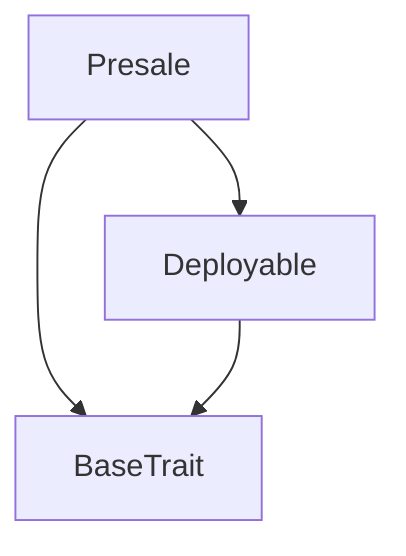

# Tact compilation report
Contract: Presale
BoC Size: 9601 bytes

## Structures (Structs and Messages)
Total structures: 23

### DataSize
TL-B: `_ cells:int257 bits:int257 refs:int257 = DataSize`
Signature: `DataSize{cells:int257,bits:int257,refs:int257}`

### SignedBundle
TL-B: `_ signature:fixed_bytes64 signedData:remainder<slice> = SignedBundle`
Signature: `SignedBundle{signature:fixed_bytes64,signedData:remainder<slice>}`

### StateInit
TL-B: `_ code:^cell data:^cell = StateInit`
Signature: `StateInit{code:^cell,data:^cell}`

### Context
TL-B: `_ bounceable:bool sender:address value:int257 raw:^slice = Context`
Signature: `Context{bounceable:bool,sender:address,value:int257,raw:^slice}`

### SendParameters
TL-B: `_ mode:int257 body:Maybe ^cell code:Maybe ^cell data:Maybe ^cell value:int257 to:address bounce:bool = SendParameters`
Signature: `SendParameters{mode:int257,body:Maybe ^cell,code:Maybe ^cell,data:Maybe ^cell,value:int257,to:address,bounce:bool}`

### MessageParameters
TL-B: `_ mode:int257 body:Maybe ^cell value:int257 to:address bounce:bool = MessageParameters`
Signature: `MessageParameters{mode:int257,body:Maybe ^cell,value:int257,to:address,bounce:bool}`

### DeployParameters
TL-B: `_ mode:int257 body:Maybe ^cell value:int257 bounce:bool init:StateInit{code:^cell,data:^cell} = DeployParameters`
Signature: `DeployParameters{mode:int257,body:Maybe ^cell,value:int257,bounce:bool,init:StateInit{code:^cell,data:^cell}}`

### StdAddress
TL-B: `_ workchain:int8 address:uint256 = StdAddress`
Signature: `StdAddress{workchain:int8,address:uint256}`

### VarAddress
TL-B: `_ workchain:int32 address:^slice = VarAddress`
Signature: `VarAddress{workchain:int32,address:^slice}`

### BasechainAddress
TL-B: `_ hash:Maybe int257 = BasechainAddress`
Signature: `BasechainAddress{hash:Maybe int257}`

### Deploy
TL-B: `deploy#946a98b6 queryId:uint64 = Deploy`
Signature: `Deploy{queryId:uint64}`

### DeployOk
TL-B: `deploy_ok#aff90f57 queryId:uint64 = DeployOk`
Signature: `DeployOk{queryId:uint64}`

### FactoryDeploy
TL-B: `factory_deploy#6d0ff13b queryId:uint64 cashback:address = FactoryDeploy`
Signature: `FactoryDeploy{queryId:uint64,cashback:address}`

### Claim
TL-B: `claim#434c4149 query_id:uint64 = Claim`
Signature: `Claim{query_id:uint64}`

### BuyAbi
TL-B: `buy_abi#42555902 ref:address = BuyAbi`
Signature: `BuyAbi{ref:address}`

### Withdraw
TL-B: `withdraw#57495448 amount:int257 = Withdraw`
Signature: `Withdraw{amount:int257}`

### WithdrawJettons
TL-B: `withdraw_jettons#574a544e to:address amount:int257 query_id:int257 = WithdrawJettons`
Signature: `WithdrawJettons{to:address,amount:int257,query_id:int257}`

### SetJettonWallet
TL-B: `set_jetton_wallet#b8e34b79 wallet:address = SetJettonWallet`
Signature: `SetJettonWallet{wallet:address}`

### ResolvePending
TL-B: `resolve_pending#8e83135b user:address action:int257 = ResolvePending`
Signature: `ResolvePending{user:address,action:int257}`

### CancelPending
TL-B: `cancel_pending#f6278819  = CancelPending`
Signature: `CancelPending{}`

### JettonTransferNotification
TL-B: `jetton_transfer_notification#7362d09c query_id:uint64 amount:int257 sender:address forward_payload:^cell = JettonTransferNotification`
Signature: `JettonTransferNotification{query_id:uint64,amount:int257,sender:address,forward_payload:^cell}`

### JettonExcesses
TL-B: `jetton_excesses#d53276db query_id:uint64 = JettonExcesses`
Signature: `JettonExcesses{query_id:uint64}`

### Presale$Data
TL-B: `_ owner_:address jettonMaster_:address jettonWallet_:address totalSoldNano_:int257 totalRaisedNano_:int257 currentRound_:int257 currentRoundSoldNano_:int257 claimableBuyer_:dict<address, int> claimableReferral_:dict<address, int> creditedBuyer_:dict<address, int> creditedRef_:dict<address, int> claimedBuyer_:dict<address, int> claimedRef_:dict<address, int> pendingTotal_:dict<address, int> pendingBuyer_:dict<address, int> pendingReferral_:dict<address, int> pendingUntil_:dict<address, int> pendingQid_:dict<address, int> nextQid_:int257 userByQid_:dict<int, address> totalClaimableNano_:int257 totalPendingNano_:int257 = Presale`
Signature: `Presale{owner_:address,jettonMaster_:address,jettonWallet_:address,totalSoldNano_:int257,totalRaisedNano_:int257,currentRound_:int257,currentRoundSoldNano_:int257,claimableBuyer_:dict<address, int>,claimableReferral_:dict<address, int>,creditedBuyer_:dict<address, int>,creditedRef_:dict<address, int>,claimedBuyer_:dict<address, int>,claimedRef_:dict<address, int>,pendingTotal_:dict<address, int>,pendingBuyer_:dict<address, int>,pendingReferral_:dict<address, int>,pendingUntil_:dict<address, int>,pendingQid_:dict<address, int>,nextQid_:int257,userByQid_:dict<int, address>,totalClaimableNano_:int257,totalPendingNano_:int257}`

## Get methods
Total get methods: 18

## codeVersion
No arguments

## ownerGetter
No arguments

## jettonMasterGetter
No arguments

## totalSoldNano
No arguments

## totalRaisedNano
No arguments

## currentRound
No arguments

## currentRoundSoldNano
No arguments

## jettonWalletSet
No arguments

## jettonWallet
No arguments

## claimableBuyerNano
Argument: addr

## claimableReferralNano
Argument: addr

## totalClaimableNano
No arguments

## totalPendingNano
No arguments

## roundCapNanoGetter
Argument: round

## roundPriceNanoGetter
Argument: round

## isPendingGetter
Argument: addr

## pendingUntilGetter
Argument: addr

## pendingQidGetter
Argument: addr

## Exit codes
* 2: Stack underflow
* 3: Stack overflow
* 4: Integer overflow
* 5: Integer out of expected range
* 6: Invalid opcode
* 7: Type check error
* 8: Cell overflow
* 9: Cell underflow
* 10: Dictionary error
* 11: 'Unknown' error
* 12: Fatal error
* 13: Out of gas error
* 14: Virtualization error
* 32: Action list is invalid
* 33: Action list is too long
* 34: Action is invalid or not supported
* 35: Invalid source address in outbound message
* 36: Invalid destination address in outbound message
* 37: Not enough Toncoin
* 38: Not enough extra currencies
* 39: Outbound message does not fit into a cell after rewriting
* 40: Cannot process a message
* 41: Library reference is null
* 42: Library change action error
* 43: Exceeded maximum number of cells in the library or the maximum depth of the Merkle tree
* 50: Account state size exceeded limits
* 128: Null reference exception
* 129: Invalid serialization prefix
* 130: Invalid incoming message
* 131: Constraints error
* 132: Access denied
* 133: Contract stopped
* 134: Invalid argument
* 135: Code of a contract was not found
* 136: Invalid standard address
* 138: Not a basechain address
* 4796: BAD_WALLET
* 5025: LOW_BALANCE
* 8654: ATTACH_MORE_TON
* 10762: JETTON_WALLET_NOT_SET
* 21744: NOTHING_TO_CLAIM
* 21886: JETTON_WALLET_ALREADY_SET
* 26941: ONLY_RESTORE_ALLOWED
* 27218: PENDING_NOT_EXPIRED
* 29392: BAD_AMOUNT
* 32846: KEEP_MIN_BALANCE
* 35582: CLAIM_PENDING_TRY_LATER
* 36337: NO_PENDING
* 39897: NOT_OWNER_OR_USER
* 41005: INTERNAL_CLAIMABLE_UNDERFLOW
* 47989: NOT_OWNER
* 48656: CLAIMABLE_EXISTS
* 52835: BAD_QID
* 59380: PENDING_EXISTS

## Trait inheritance diagram

## Contract dependency diagram

